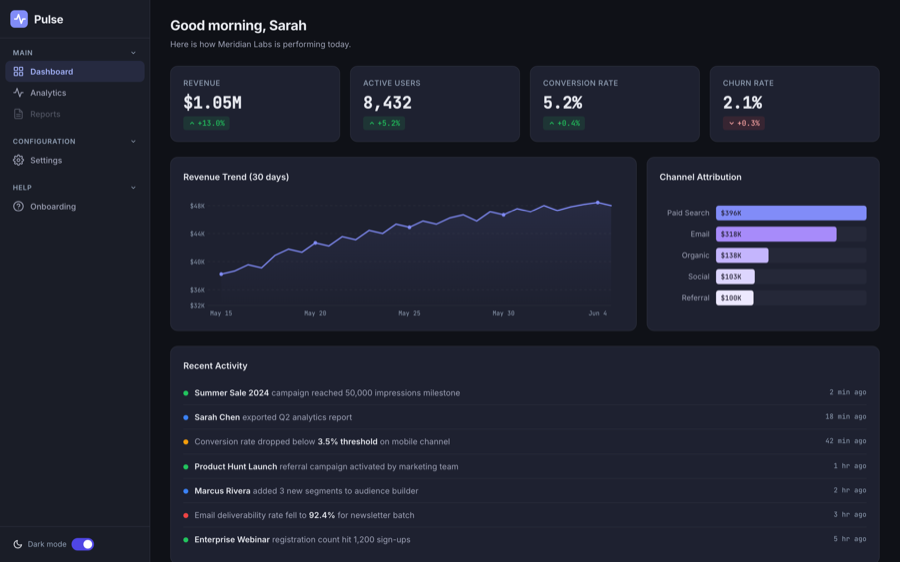
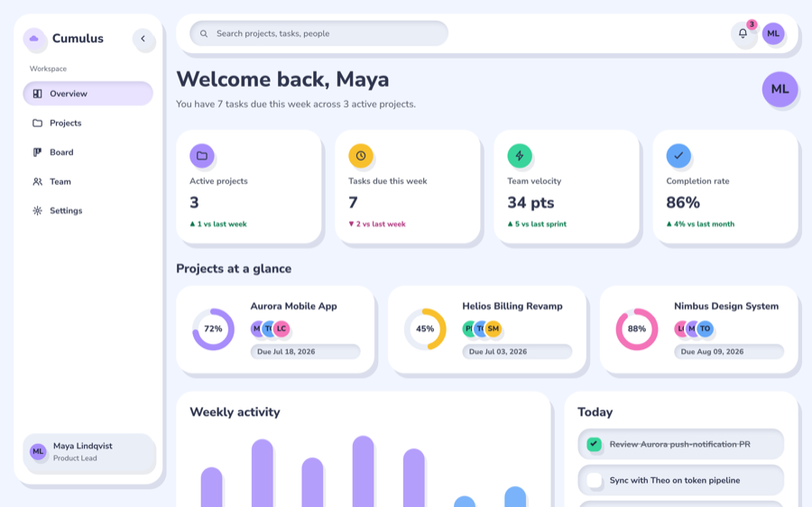
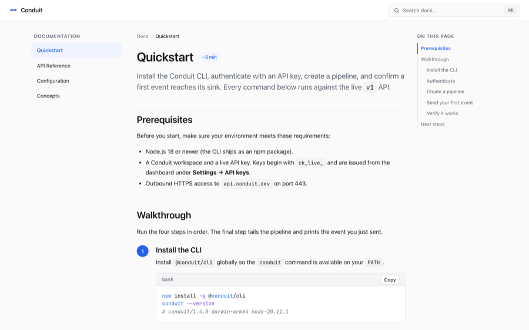
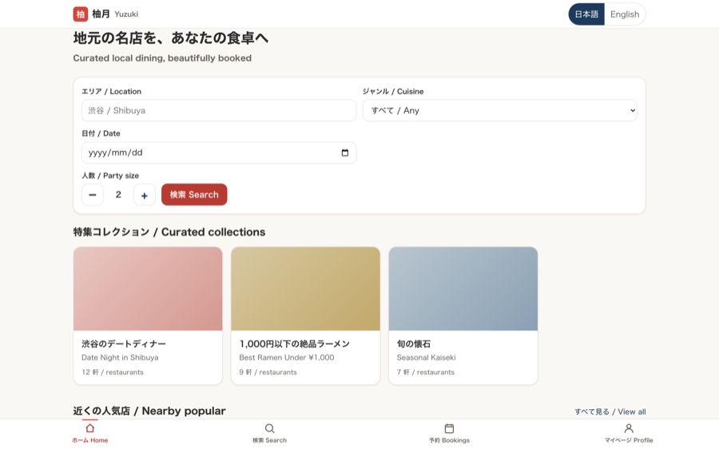

# OPC — One Person Company

> A full team in a single Claude Code skill. You're the CEO — OPC is everyone else.

16 specialist agents (PM, Designer, Security, Devil's Advocate, and more) that build, review, and evaluate your code through a digraph-based pipeline with code-enforced quality gates.

[English](#english) | [中文](#中文)

---

## English

### What you can build

From a **single one-line brief**, OPC's `build-verify` flow ships a complete, production-quality product — design tokens injected and visual quality validated by the [design-intelligence](https://github.com/iamtouchskyer/opc-extensions) extension. Every screenshot below is a **real, clickable site** (not a mockup), built by the same 16-agent pipeline. Same system, six completely different design languages.

**▶ [Browse the live lookbook →](https://www.touchskyer.me/projects/opc/lookbook)**

<table>
<tr>
<td width="50%" valign="top">
<a href="https://www.touchskyer.me/projects/opc/lookbook/saas-dashboard/index.html"></a>
<br><b>Pulse</b> · SaaS analytics dashboard<br><sub>Dark UI · data-viz</sub>
</td>
<td width="50%" valign="top">
<a href="https://www.touchskyer.me/projects/opc/lookbook/creative-portfolio/index.html"></a>
<br><b>Studio Kura</b> · Creative agency portfolio<br><sub>Brutalist · editorial · motion</sub>
</td>
</tr>
<tr>
<td width="50%" valign="top">
<a href="https://www.touchskyer.me/projects/opc/lookbook/cumulus/index.html"></a>
<br><b>Cumulus</b> · Project-management dashboard<br><sub>Claymorphism · pastel</sub>
</td>
<td width="50%" valign="top">
<a href="https://www.touchskyer.me/projects/opc/lookbook/devtool-docs/index.html"></a>
<br><b>Conduit Docs</b> · Developer documentation<br><sub>Docs · code · developer</sub>
</td>
</tr>
<tr>
<td width="50%" valign="top">
<a href="https://www.touchskyer.me/projects/opc/lookbook/dtc-brand/index.html"></a>
<br><b>Maison Terre</b> · DTC skincare e-commerce<br><sub>Brand · editorial</sub>
</td>
<td width="50%" valign="top">
<a href="https://www.touchskyer.me/projects/opc/lookbook/local-booking/index.html"></a>
<br><b>Yuzuki 柚月</b> · Local dining platform<br><sub>Booking · bilingual · mobile</sub>
</td>
</tr>
</table>

> Each card in the [lookbook](https://www.touchskyer.me/projects/opc/lookbook) flips on hover to reveal the **exact prompt** that built it — e.g. Pulse came from one line: `/opc build a production-quality SaaS analytics dashboard called "Pulse"...`

**OPC isn't only for UIs.** The same zero-trust pipeline also handles:

- **Whole products, unattended** — `/opc loop build features F1–F4 from PLAN.md` decomposes the work, schedules a durable cron, and runs **10+ hours** without you.
- **Code review** — `/opc review the auth changes` dispatches 2–5 independent role agents (security, backend, a11y, devil's advocate) in parallel and computes a mechanical verdict.
- **Full-stack features** — `/opc implement user auth with email/password` runs build → independent review → test-design → test-execute → gate.
- **Pre-release audits** — `/opc verify before release` runs acceptance + audit + e2e gates before you ship.

### How It Works

One principle: **the agent that does the work never evaluates it.**

```
Task → Flow Selection → Node Execution → Gate Verdict → Route Next
                              ↑                              ↓
                              └──────── ITERATE/FAIL ────────┘
```

1. **Task inference** — reads your request, picks a flow template (quick, review, build-verify, full-stack, pre-release), and enters at the right node.

2. **Typed nodes** — each node has a type (discussion, build, review, execute, gate) with specific protocols. Build nodes produce commits. Review nodes dispatch parallel subagents. Gate nodes compute verdicts from code, not LLM judgment.

3. **Mechanical gates** — verdicts are computed by `opc-harness synthesize`: any red = FAIL, any yellow = ITERATE, all green = PASS. No LLM gets to decide if a finding is "important enough."

4. **Cycle limits** — max 3 loops per edge, 5 re-entries per node, 20-30 total steps depending on flow. Oscillation detection catches A↔B loops.

#### Quality Architecture


The system is built on a zero-trust axiom: **every critical output must have an independent verification path.** Four layers:

- **L0 — Zero Trust**: Decision axiom — not code, not prompt. Every critical output needs an independent verification path.
- **L1 — Shape Single Agent**: Intervene during token generation — persona setting, anti-pattern tables, mandatory output structure, scope anchoring, quality gates.
- **L2 — Design Agent Flow**: Multi-agent coordination — separation of concerns, flow topology (parallel review / sequential build), context isolation (file-based handoff, fresh agents, no session reuse).
- **L3 — Deterministic Enforcement**: The only layer that doesn't need LLM compliance — mechanical ops (severity counting, verdict rules, oscillation diff) and hardened verification (file-finding evidence checks, hedging scans, ref validation).

#### Model-aware dispatch

OPC preserves its full multi-agent topology while avoiding accidental premium-model fan-out. Before every Agent call, `opc-harness model-route` resolves an explicit host-native model from layered configuration:

| Tier | Claude Code default | Typical work |
|---|---|---|
| economy | `haiku` | test design, user/UX observers |
| standard | `sonnet` | discussion, implementation, semantic review |
| premium | `inherit` | explicit escalation only |

`inherit` and `opus` require explicit premium approval. Claude Code's `CLAUDE_CODE_SUBAGENT_MODEL` environment override is detected and reported. Other hosts can replace the tier values with their own model IDs:

```json
{
  "agentRouting": {
    "models": {
      "economy": "your-fast-model-id",
      "standard": "your-value-model-id",
      "premium": "your-premium-model-id"
    }
  }
}
```

See [`pipeline/model-routing.md`](pipeline/model-routing.md) for node/role overrides and the resolver contract.

### Quick Start

#### Install

```bash
npm install -g @touchskyer/opc
```

Skill files are automatically copied to `~/.claude/skills/opc/`.

##### Manual install (no npm)

```bash
git clone https://github.com/iamtouchskyer/opc.git
cp -r opc ~/.claude/skills/opc
```

#### Use it

```bash
# Review — dispatches 2-5 role agents in parallel
/opc review the auth changes

# Build — implements + independent review + gate
/opc implement user authentication with email/password

# Autonomous loop — decomposes, schedules cron, runs unattended
/opc loop build features F1-F4 from PLAN.md

# Interactive mode — asks clarifying questions first
/opc -i redesign the onboarding flow

# Explicit roles
/opc security devil-advocate

# Flow control
/opc skip          # skip current node
/opc pass          # force-pass gate
/opc stop          # terminate, preserve state
/opc goto build    # jump to node
```

### Autonomous Loop

```bash
/opc loop build the math tutoring app features F1-F4
```

What happens:
1. **Runbook lookup** — `opc-harness runbook match "<task>"` checks `--dir` flag → `OPC_RUNBOOKS_DIR` → `~/.opc/runbooks/` for a matching recipe. If one hits, its `units` / `flow` / `tier` become the plan; otherwise fall through to step 2. Disable per-invocation with `OPC_DISABLE_RUNBOOKS=1`. See [docs/runbooks.md](docs/runbooks.md) and [examples/runbooks/add-feature.md](examples/runbooks/add-feature.md).
2. **Decompose** (runbook miss only) — breaks task into atomic units (spec, implement, review, fix, e2e)
3. **Definition of done** — establishes verify/eval criteria per unit before any work starts
4. **Schedule** — durable cron (survives process restart) fires every 10 min
5. **Execute** — each tick runs one unit through the appropriate OPC flow
6. **Guard** — `opc-harness` enforces: git commit required, ≥2 independent reviewers, no plan tampering, no state forgery, artifact freshness, tick limits
7. **Terminate** — auto-stops when plan complete, tick limit hit, or wall-clock deadline reached

For well-scoped tasks, the system runs **10+ hours continuously** without intervention.

#### Guardrails (code-enforced, not prompt-level)

| Guard | Enforcement |
|-------|-------------|
| Write nonce | Random SHA256 at init; state written by harness only |
| Atomic writes | write → rename (POSIX atomic); no truncated JSON on crash |
| Plan integrity | SHA256 hash at init; verified every tick |
| Review independence | ≥2 eval files, identical content rejected, line overlap warned |
| Git commit required | HEAD must change for implement/fix units |
| Screenshot required | UI units must produce .png/.jpg artifact |
| Tick limits | maxTotalTicks (units×3) + 24h wall-clock deadline |
| Oscillation detection | A↔B pattern over 4-6 ticks = warning/hard stop |
| Concurrent tick mutex | in_progress status blocks overlapping cron fires |
| JSON crash recovery | try/catch on all JSON.parse; structured errors, not crashes |
| External validators | Pre-commit hooks, test suites detected at init and leveraged |

### Flow Templates

| Template | Nodes | When |
|----------|-------|------|
| **quick** | build → review → gate | "quick fix", "small change", one-liner, ≤3 files, **non-UI, no logic branches** |
| **review** | code-review → gate | PR review, audit, "find problems" |
| **build-verify** | brief → build → code-review → test-design → test-execute; ITERATE → hotfix → test-execute; PASS → gate | "implement X", "fix bug Y" |
| **full-stack** | discuss → build → review → test → acceptance → audit → e2e → gates | Complex/vague requests |
| **pre-release** | acceptance → audit → e2e → gates | "verify before release" |

**`quick` vs `build-verify`** — `quick` drops the structured `brief` node and the
`test-design`/`test-execute` split, halving nodes and evaluator dispatches. It keeps
the core quality gate (independent `review` + `gate` verdict). Use it only for true
one-liners / single-file, non-UI, no-logic-branch changes. Anything with logic
branches, multiple files, or UI → use `build-verify`, where `test-design`'s enforced
L1–L5 coverage check earns its keep.

The **`brief`** node (entry of `build-verify`) produces a structured build brief —
resolved design tokens, file plan, component inventory, constraints — that the
`build` node follows. It measurably lifts first-pass build fidelity, but the brief
describes *intended* behavior: downstream `test-design` must test the **actual built
code**, not the brief's ideal, or it will assert behavior the build never implemented.

### Extensions

OPC has a capability-routed extension surface. Extensions live in
`~/.claude/skills/opc-extension/<name>/` — each with `ext.json` (capability
declarations) + `hook.mjs` exporting any of `promptAppend` / `verdictAppend`
/ `executeRun` / `artifactEmit` hooks. No fork, no rebuild. Hooks are
sandboxed via per-extension timeouts + circuit breakers, so a broken
third-party extension can't take down the harness.

`ext.json.version` is recorded in `flow-state.json → extensionVersions` during
`init`, so protocol reports can distinguish "extension loaded" from "unknown
version". Executable hook metadata from `hook.mjs` still wins for runtime
capability behavior.

The companion repo **[opc-extensions](https://github.com/iamtouchskyer/opc-extensions)** ships 4 extensions: `design-intelligence` (theme injection + design coverage + VLM visual eval), `git-changeset-review`, `memex-recall`, and `session-logex`.

Full authoring guide: **[docs/extension-authoring.md](docs/extension-authoring.md)** — zero-OPC-context
quickstart + reference, plus a starter template at `examples/extensions/_starter/`.

### Built-in Roles

```
Product:     pm, designer
User Lens:   new-user, active-user, churned-user
Engineering: frontend, backend, devops, architect, engineer
Quality:     security, tester, compliance, a11y
Specialist:  planner, user-simulator, devil-advocate
```

**Devil's Advocate** (the 10th person) is auto-included when consensus is near-unanimous or decisions are irreversible. Comes with an automated verification script that checks its own findings.

#### Custom Roles

Add a `.md` file to `roles/`:

```markdown
---
tags: [review, build]
---
# Role Name

## Identity
One sentence: who you are and what you care about.

## Expertise
- **Area** — what you know about it

## When to Include
- Condition that triggers this role
```

Available immediately, no configuration needed.

### Testing

```bash
bash test/run-all.sh
```

100+ test files covering init-loop, complete-tick, next-tick, review independence, JSON crash recovery, compound defense, scope registry, criteria lint, pipeline E2E lint, D2 calibration, release packaging, and orchestrator-level E2E flow tests.

### Requirements

- [Claude Code](https://claude.ai/code) (CLI, desktop app, or IDE extension)
- Node.js >= 18
- Core runtime has no npm dependencies, no MCP server, no build step
- Optional: `jq` for `opc install-hooks` context-compaction hooks

### Works better with memex (optional)

OPC works standalone — pair it with [memex](https://github.com/iamtouchskyer/memex) for cross-session memory. Memex remembers which roles were useful, which findings were false positives, and your project-specific context.

```bash
npm install -g @touchskyer/memex
```

### What's New

See [CHANGELOG.md](CHANGELOG.md) for version history.

### Community

Using OPC? Share your setup in [Discussions → Show and tell](https://github.com/iamtouchskyer/opc/discussions/categories/show-and-tell). Questions go in [Q&A](https://github.com/iamtouchskyer/opc/discussions/categories/q-a). Feature ideas in [Ideas](https://github.com/iamtouchskyer/opc/discussions/categories/ideas).

### License

MIT

---

## 中文

### 你能用它造什么

从**一句话需求**出发，OPC 的 `build-verify` 流程就能交付一个完整、生产级的产品——设计令牌（design token）由 [design-intelligence](https://github.com/iamtouchskyer/opc-extensions) 扩展注入、视觉质量由它验证。下面每一张截图都是**真实可点击的站点**（不是设计稿），由同一套 16-agent 流水线构建。同一套系统，六种完全不同的设计语言。

**▶ [浏览在线作品集 →](https://www.touchskyer.me/projects/opc/lookbook)**

<table>
<tr>
<td width="50%" valign="top">
<a href="https://www.touchskyer.me/projects/opc/lookbook/saas-dashboard/index.html"></a>
<br><b>Pulse</b> · SaaS 分析仪表盘<br><sub>暗色 UI · 数据可视化</sub>
</td>
<td width="50%" valign="top">
<a href="https://www.touchskyer.me/projects/opc/lookbook/creative-portfolio/index.html"></a>
<br><b>Studio Kura</b> · 创意工作室作品集<br><sub>粗野主义 · 编辑风 · 动效</sub>
</td>
</tr>
<tr>
<td width="50%" valign="top">
<a href="https://www.touchskyer.me/projects/opc/lookbook/cumulus/index.html"></a>
<br><b>Cumulus</b> · 项目管理仪表盘<br><sub>黏土拟态 · 柔和色彩</sub>
</td>
<td width="50%" valign="top">
<a href="https://www.touchskyer.me/projects/opc/lookbook/devtool-docs/index.html"></a>
<br><b>Conduit Docs</b> · 开发者文档站<br><sub>文档 · 代码 · 开发者</sub>
</td>
</tr>
<tr>
<td width="50%" valign="top">
<a href="https://www.touchskyer.me/projects/opc/lookbook/dtc-brand/index.html"></a>
<br><b>Maison Terre</b> · 护肤品 DTC 电商<br><sub>品牌 · 编辑风</sub>
</td>
<td width="50%" valign="top">
<a href="https://www.touchskyer.me/projects/opc/lookbook/local-booking/index.html"></a>
<br><b>Yuzuki 柚月</b> · 本地餐饮平台<br><sub>预订 · 双语 · 移动端</sub>
</td>
</tr>
</table>

> [作品集](https://www.touchskyer.me/projects/opc/lookbook)里每张卡片悬停时会翻面，露出**生成它的原始 prompt**——比如 Pulse 就来自一句话：`/opc build a production-quality SaaS analytics dashboard called "Pulse"...`

**OPC 不只是用来做 UI。** 同一套零信任流水线还能：

- **无人值守造完整产品** —— `/opc loop build features F1–F4 from PLAN.md` 拆解任务、调度持久 cron，**连续运行 10+ 小时**无需干预。
- **代码审查** —— `/opc review the auth changes` 并行派发 2–5 个独立角色 agent（security、backend、a11y、devil's advocate），用代码计算裁决。
- **全栈功能** —— `/opc implement user auth with email/password` 跑 build → 独立 review → test-design → test-execute → gate。
- **发布前审计** —— `/opc verify before release` 在上线前跑 acceptance + audit + e2e 门禁。

### 工作原理

一条原则：**做事的 agent 永远不评判自己的工作。**

```
Task → Flow Selection → Node Execution → Gate Verdict → Route Next
                              ↑                              ↓
                              └──────── ITERATE/FAIL ────────┘
```

1. **任务推断** —— 读取你的请求，选一个 flow 模板（quick、review、build-verify、full-stack、pre-release），从正确的节点进入。

2. **类型化节点** —— 每个节点有类型（discussion、build、review、execute、gate）和特定协议。build 节点产出 commit；review 节点派发并行 subagent；gate 节点用代码而非 LLM 判断计算裁决。

3. **机械门禁** —— 裁决由 `opc-harness synthesize` 计算：任意 red = FAIL，任意 yellow = ITERATE，全 green = PASS。没有任何 LLM 能决定某个发现"是否足够重要"。

4. **循环上限** —— 每条边最多 3 次循环，每个节点最多 5 次重入，按 flow 总步数 20-30。震荡检测捕获 A↔B 循环。

#### 质量架构


系统建立在一条零信任公理上：**每个关键输出都必须有独立的验证路径。** 四层：

- **L0 —— 零信任**：决策公理——不是代码，不是 prompt。每个关键输出都需要独立的验证路径。
- **L1 —— 塑造单个 agent**：在 token 生成过程中干预——人格设定、反模式表、强制输出结构、范围锚定、质量门禁。
- **L2 —— 设计 agent 流**：多 agent 协同——关注点分离、流拓扑（并行 review / 串行 build）、上下文隔离（基于文件的交接、全新 agent、不复用 session）。
- **L3 —— 确定性强制**：唯一不需要 LLM 配合的一层——机械操作（严重度计数、裁决规则、震荡 diff）和加固验证（找文件证据检查、模糊措辞扫描、引用校验）。

#### 模型感知派发

OPC 保留完整的多 agent 拓扑，同时避免顶级模型被意外放大到所有子 agent。每次调用 Agent 前，`opc-harness model-route` 都会从分层配置中解析一个明确的宿主原生模型：

| 层级 | Claude Code 默认值 | 典型工作 |
|---|---|---|
| economy | `haiku` | 测试设计、用户/UX observer |
| standard | `sonnet` | 讨论、实现、语义审查 |
| premium | `inherit` | 仅显式升级 |

`inherit` 和 `opus` 需要显式批准。Claude Code 的 `CLAUDE_CODE_SUBAGENT_MODEL` 环境变量覆盖会被检测并展示。其他宿主可以在 `agentRouting.models` 中替换成自己的模型 ID，而无需修改 OPC 的 flow。

完整的节点/角色覆盖规则见 [`pipeline/model-routing.md`](pipeline/model-routing.md)。

### 快速开始

#### 安装

```bash
npm install -g @touchskyer/opc
```

Skill 文件会自动复制到 `~/.claude/skills/opc/`。

##### 手动安装（不用 npm）

```bash
git clone https://github.com/iamtouchskyer/opc.git
cp -r opc ~/.claude/skills/opc
```

#### 使用

```bash
# 审查 —— 并行派发 2-5 个角色 agent
/opc review the auth changes

# 构建 —— 实现 + 独立 review + gate
/opc implement user authentication with email/password

# 自主循环 —— 拆解、调度 cron、无人值守运行
/opc loop build features F1-F4 from PLAN.md

# 交互模式 —— 先问清楚需求
/opc -i redesign the onboarding flow

# 显式指定角色
/opc security devil-advocate

# 流程控制
/opc skip          # 跳过当前节点
/opc pass          # 强制通过 gate
/opc stop          # 终止，保留状态
/opc goto build    # 跳转到指定节点
```

### 自主循环

```bash
/opc loop build the math tutoring app features F1-F4
```

会发生什么：
1. **Runbook 查找** —— `opc-harness runbook match "<task>"` 按 `--dir` flag → `OPC_RUNBOOKS_DIR` → `~/.opc/runbooks/` 顺序查找匹配的配方。命中则用它的 `units` / `flow` / `tier` 作为 plan；否则进入第 2 步。可用 `OPC_DISABLE_RUNBOOKS=1` 按次禁用。见 [docs/runbooks.md](docs/runbooks.md) 和 [examples/runbooks/add-feature.md](examples/runbooks/add-feature.md)。
2. **拆解**（仅 runbook miss）—— 把任务拆成原子单元（spec、implement、review、fix、e2e）
3. **完成定义** —— 任何工作开始前，为每个单元建立 verify/eval 标准
4. **调度** —— 持久 cron（进程重启后存活）每 10 分钟触发
5. **执行** —— 每个 tick 跑一个单元，走对应的 OPC flow
6. **守卫** —— `opc-harness` 强制：必须 git commit、≥2 个独立审查者、不可篡改 plan、不可伪造 state、artifact 新鲜度、tick 上限
7. **终止** —— plan 完成、tick 上限、或墙钟截止时自动停止

对于范围明确的任务，系统可**连续运行 10+ 小时**无需干预。

#### 守卫（代码强制，非 prompt 层）

| 守卫 | 强制方式 |
|------|---------|
| Write nonce | init 时生成随机 SHA256；state 只能由 harness 写入 |
| 原子写入 | write → rename（POSIX 原子）；崩溃时不留半截 JSON |
| Plan 完整性 | init 时算 SHA256 哈希；每个 tick 校验 |
| 审查独立性 | ≥2 个 eval 文件，内容雷同则拒绝，行重叠则告警 |
| 必须 git commit | implement/fix 单元的 HEAD 必须变化 |
| 必须截图 | UI 单元必须产出 .png/.jpg artifact |
| Tick 上限 | maxTotalTicks（units×3）+ 24h 墙钟截止 |
| 震荡检测 | 4-6 个 tick 内出现 A↔B 模式 = 告警/硬停 |
| 并发 tick 互斥 | in_progress 状态阻止重叠的 cron 触发 |
| JSON 崩溃恢复 | 所有 JSON.parse 加 try/catch；结构化报错而非崩溃 |
| 外部校验器 | init 时检测并利用 pre-commit hook、测试套件 |

### 流模板

| 模板 | 节点 | 何时用 |
|------|------|--------|
| **quick** | build → review → gate | "快速修复"、"小改动"、一行改动、≤3 文件，**非 UI、无逻辑分支** |
| **review** | code-review → gate | PR 审查、审计、"找问题" |
| **build-verify** | brief → build → code-review → test-design → test-execute；ITERATE → hotfix → test-execute；PASS → gate | "实现 X"、"修复 bug Y" |
| **full-stack** | discuss → build → review → test → acceptance → audit → e2e → gates | 复杂/模糊的请求 |
| **pre-release** | acceptance → audit → e2e → gates | "发布前验证" |

**`quick` vs `build-verify`** —— `quick` 砍掉结构化的 `brief` 节点和 `test-design`/`test-execute` 拆分，节点数和评估器派发减半。它保留了核心质量门禁（独立 `review` + `gate` 裁决）。只在真正的一行改动 / 单文件、非 UI、无逻辑分支时用。任何带逻辑分支、多文件或 UI 的 → 用 `build-verify`，那里 `test-design` 强制的 L1–L5 覆盖检查才物有所值。

**`brief`** 节点（`build-verify` 的入口）产出一份结构化构建简报——解析后的设计令牌、文件计划、组件清单、约束——供 `build` 节点遵循。它能可量化地提升首次构建保真度，但简报描述的是*预期*行为：下游 `test-design` 必须测**实际构建出来的代码**，而非简报里的理想，否则它会断言构建从未实现的行为。

### 扩展

OPC 有一个能力路由（capability-routed）的扩展面。扩展位于 `~/.claude/skills/opc-extension/<name>/`——每个带一个 `ext.json`（能力声明）+ 一个 `hook.mjs`，导出 `promptAppend` / `verdictAppend` / `executeRun` / `artifactEmit` 中的任意 hook。不用 fork、不用重新构建。Hook 通过每扩展超时 + 熔断器沙箱化，所以一个坏掉的第三方扩展无法拖垮 harness。

`ext.json.version` 在 `init` 时记录到 `flow-state.json → extensionVersions`，所以协议报告能区分"扩展已加载"和"未知版本"。运行时能力行为仍以 `hook.mjs` 的可执行 hook 元数据为准。

配套仓库 **[opc-extensions](https://github.com/iamtouchskyer/opc-extensions)** 提供 4 个扩展：`design-intelligence`（主题注入 + 设计覆盖 + VLM 视觉评估）、`git-changeset-review`、`memex-recall`、`session-logex`。

完整编写指南：**[docs/extension-authoring.md](docs/extension-authoring.md)**——零 OPC 上下文的快速上手 + 参考，外加 `examples/extensions/_starter/` 里的起步模板。

### 内置角色

```
Product:     pm, designer
User Lens:   new-user, active-user, churned-user
Engineering: frontend, backend, devops, architect, engineer
Quality:     security, tester, compliance, a11y
Specialist:  planner, user-simulator, devil-advocate
```

**Devil's Advocate**（第 10 个人）在共识近乎一致、或决策不可逆时自动加入。配有一个自动验证脚本，检查它自己的发现。

#### 自定义角色

在 `roles/` 里加一个 `.md` 文件：

```markdown
---
tags: [review, build]
---
# Role Name

## Identity
One sentence: who you are and what you care about.

## Expertise
- **Area** — what you know about it

## When to Include
- Condition that triggers this role
```

即刻可用，无需配置。

### 测试

```bash
bash test/run-all.sh
```

100+ 测试文件，覆盖 init-loop、complete-tick、next-tick、审查独立性、JSON 崩溃恢复、复合防御、scope registry、criteria lint、pipeline E2E lint、D2 校准、发布打包，以及编排器层级的 E2E 流程测试。

### 环境要求

- [Claude Code](https://claude.ai/code)（CLI、桌面应用或 IDE 扩展）
- Node.js >= 18
- 核心运行时无 npm 依赖、无 MCP server、无构建步骤
- 可选：`jq`，用于 `opc install-hooks` 的上下文压缩 hook

### 搭配 memex 更好（可选）

OPC 可独立使用——搭配 [memex](https://github.com/iamtouchskyer/memex) 获得跨会话记忆。Memex 记住哪些角色有用、哪些发现是误报，以及你项目特定的上下文。

```bash
npm install -g @touchskyer/memex
```

### 更新日志

版本历史见 [CHANGELOG.md](CHANGELOG.md)。

### 社区

在用 OPC？到 [Discussions → Show and tell](https://github.com/iamtouchskyer/opc/discussions/categories/show-and-tell) 分享你的玩法。问题发 [Q&A](https://github.com/iamtouchskyer/opc/discussions/categories/q-a)，功能想法发 [Ideas](https://github.com/iamtouchskyer/opc/discussions/categories/ideas)。

### 许可

MIT
